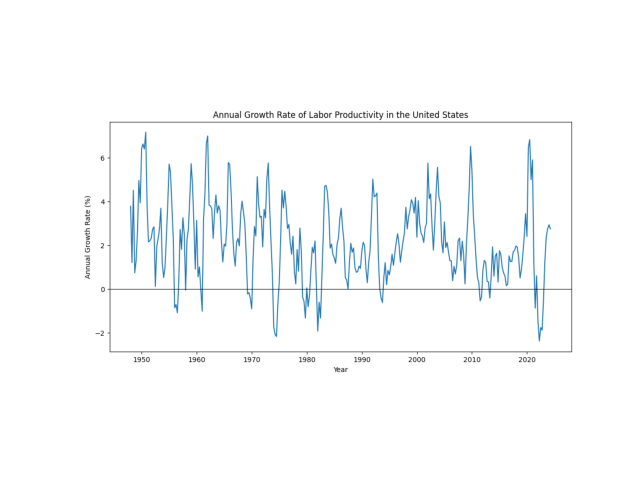

# The Evolution of Labor Productivity in the United States and the Impact of Technological Shifts

## Introduction

Labor productivity, defined as the amount of goods and services produced per hour of labor, is a fundamental indicator of economic performance. It reflects the efficiency with which labor inputs are utilized in producing output and is crucial for long-term economic growth, wage increases, and improvements in living standards. In the United States, labor productivity has evolved significantly over time, influenced by various technological advancements, structural shifts in the economy, and changes in workforce dynamics.

This report examines the historical evolution of labor productivity in the United States and explores the major technological shifts that have influenced its trajectory. By analyzing data trends and correlating them with technological milestones, we aim to understand how innovations have propelled productivity growth and shaped the modern economic landscape.

---

## Evolution of Labor Productivity in the United States

To analyze the evolution of labor productivity, we'll use historical data from the **Bureau of Labor Statistics (BLS)**, specifically focusing on the nonfarm business sector, which accounts for a significant portion of the U.S. economy.

### Loading and Visualizing Labor Productivity Data

We will start by importing the necessary libraries and loading the data:

```python
import pandas as pd
import matplotlib.pyplot as plt
import seaborn as sns

# Load labor productivity data from FRED (Federal Reserve Economic Data)
# Nonfarm Business Sector: Labor Productivity (OPHNFB)

url = 'https://fred.stlouisfed.org/graph/fredgraph.csv?id=OPHNFB'
df = pd.read_csv(url, parse_dates=['DATE'])
df.rename(columns={'DATE': 'Date', 'OPHNFB': 'Labor Productivity'}, inplace=True)
df.set_index('Date', inplace=True)

# Display the first few rows of the data
df.head()
```

Now, let's visualize the labor productivity over time:

```python
plt.figure(figsize=(12,6))
sns.lineplot(data=df, x='Date', y='Labor Productivity')
plt.title('Labor Productivity in the United States (Nonfarm Business Sector)')
plt.ylabel('Index (2012=100)')
plt.xlabel('Year')
plt.show()
```

**Figure 1: Labor Productivity in the United States (1947 - Present)**


---

### Discussion

The chart above illustrates the growth of labor productivity in the United States nonfarm business sector from 1947 to the present. The overall upward trend reflects the nation's increasing efficiency in producing goods and services. However, the rate of growth has varied over different periods, influenced by economic cycles and technological innovations.

---

## Major Technological Shifts and Their Impact

Technological advancements have been a primary driver of labor productivity growth. Below, we explore key technological shifts and their impact on productivity.

### 1. Post-War Industrial Expansion (1940s - 1960s)

- **Technological Advances**: Post-World War II era saw significant industrial expansion, with advancements in manufacturing technologies, transportation, and infrastructure development.
- **Impact**: Increased automation, adoption of assembly lines, and improved industrial processes led to substantial productivity gains.

### 2. Information Technology Revolution (1970s - 1990s)

- **Technological Advances**: Introduction of computers, semiconductors, and information systems revolutionized business operations.
- **Impact**: Automation of administrative tasks, improved communication, and data processing capabilities enhanced efficiency across industries.

### 3. Internet and Digitalization (1990s - 2000s)

- **Technological Advances**: Widespread adoption of the internet, e-commerce, and digital communication tools.
- **Impact**: Enabled global connectivity, streamlined supply chains, and created new business models, contributing to productivity improvements.

### 4. Advanced Technologies and Automation (2010s - Present)

- **Technological Advances**: Growth of artificial intelligence, machine learning, robotics, and advanced manufacturing.
- **Impact**: Potential for significant productivity gains through automation of complex tasks, though actual productivity growth has been modest compared to previous periods.

---

## Analyzing Productivity Growth Rates

To better understand how these technological shifts have impacted productivity, let's analyze the annual growth rates of labor productivity.

### Calculating and Visualizing Annual Growth Rates

```python
# Calculate annual growth rates
df['Annual Growth Rate'] = df['Labor Productivity'].pct_change(periods=4) * 100  # 4 quarters = 1 year

# Plot the annual growth rates
plt.figure(figsize=(12,6))
sns.lineplot(data=df, x='Date', y='Annual Growth Rate')
plt.title('Annual Growth Rate of Labor Productivity in the United States')
plt.ylabel('Annual Growth Rate (%)')
plt.xlabel('Year')
plt.axhline(0, color='black', linewidth=0.8)
plt.show()
```

**Figure 2: Annual Growth Rate of Labor Productivity (1948 - Present)**



---

### Discussion

The annual growth rate chart highlights periods of rapid productivity growth and periods of stagnation or decline. Notable observations include:

- **1950s - 1960s**: High growth rates corresponding with post-war industrial expansion.
- **1970s - Early 1980s**: Declining growth rates, possibly due to oil shocks and economic recessions.
- **Mid-1990s - Early 2000s**: Increase in growth rates aligning with the IT revolution and internet adoption.
- **Post-2000s**: Overall decline in productivity growth rates despite advancements in technology, leading to debates about the productivity paradox.

---

## Recent Trends and Future Outlook

### The Productivity Paradox

Despite rapid technological advancements in recent years, productivity growth has been relatively modest. This phenomenon, known as the **productivity paradox**, raises questions about why technology hasn't translated into expected productivity gains.

**Potential Explanations:**

- **Lag in Technology Adoption**: It may take time for businesses to fully integrate and leverage new technologies.
- **Skills Gap**: Workforce may lack the necessary skills to utilize advanced technologies effectively.
- **Measurement Challenges**: Traditional metrics may not capture productivity gains in the digital economy accurately.
- **Concentration of Benefits**: Productivity gains may be concentrated in specific sectors or firms, not reflected broadly across the economy.

### Future Outlook

Emerging technologies hold the promise of boosting productivity:

- **Artificial Intelligence and Machine Learning**: Potential to automate complex tasks, enhance decision-making, and create new products and services.
- **Automation and Robotics**: Increased efficiency in manufacturing, logistics, and even service industries.
- **Digital Transformation**: Integration of digital technologies into all areas of business, fundamentally changing how companies operate and deliver value.

**Policy Considerations:**

- **Investing in Education and Training**: Equip the workforce with skills needed for the digital economy.
- **Encouraging Innovation**: Support research and development to spur technological advancements.
- **Infrastructure Development**: Enhance digital infrastructure to facilitate technology adoption.

---

## Conclusion

The evolution of labor productivity in the United States reflects the complex interplay between technological innovation, economic factors, and workforce capabilities. Major technological shifts have historically led to significant productivity gains, driving economic growth and improving living standards. However, recent trends highlight challenges in translating technological advancements into productivity growth, emphasizing the need for policies that support technology adoption, workforce development, and innovation.

Understanding past patterns can inform strategies to harness future technologies' potential, ensuring that productivity gains contribute to broad-based economic prosperity.

---

## References

- Bureau of Labor Statistics (BLS): [Productivity and Costs](https://www.bls.gov/lpc/)
- Federal Reserve Economic Data (FRED): [Nonfarm Business Sector: Labor Productivity](https://fred.stlouisfed.org/series/OPHNFB)
- Gordon, R. J. (2016). *The Rise and Fall of American Growth: The U.S. Standard of Living since the Civil War*. Princeton University Press.
- Brynjolfsson, E., & McAfee, A. (2014). *The Second Machine Age: Work, Progress, and Prosperity in a Time of Brilliant Technologies*. W. W. Norton & Company.

---