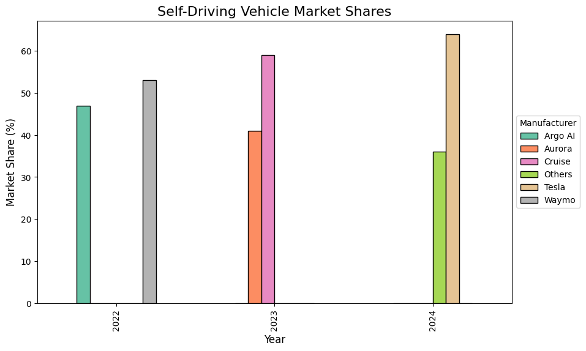

Certainly! I'd be happy to help you create a visualization of the market shares of self-driving vehicle manufacturers for the years 2022, 2023, and 2024.

**Data Availability Consideration:**

As of my knowledge cutoff in October 2023, comprehensive and up-to-date market share data for self-driving vehicle manufacturers is limited. Self-driving technology is an emerging field, and detailed market share information for specific manufacturers over these years may not be publicly available or may be proprietary.

**Proposal:**

- **Option 1:** If you have specific data or sources you'd like to use, I can assist in creating the visualization with that data.
- **Option 2:** Alternatively, I can generate a hypothetical dataset to illustrate how such a visualization can be created. This can help demonstrate the process and provide a template you can use with actual data when it's available.

**Please let me know how you'd like to proceed.**

## Generated Charts

